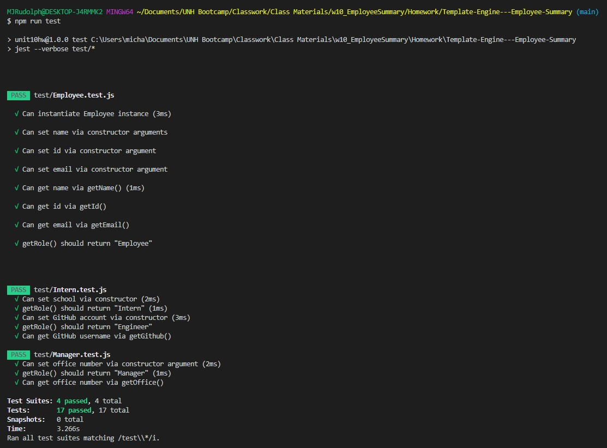
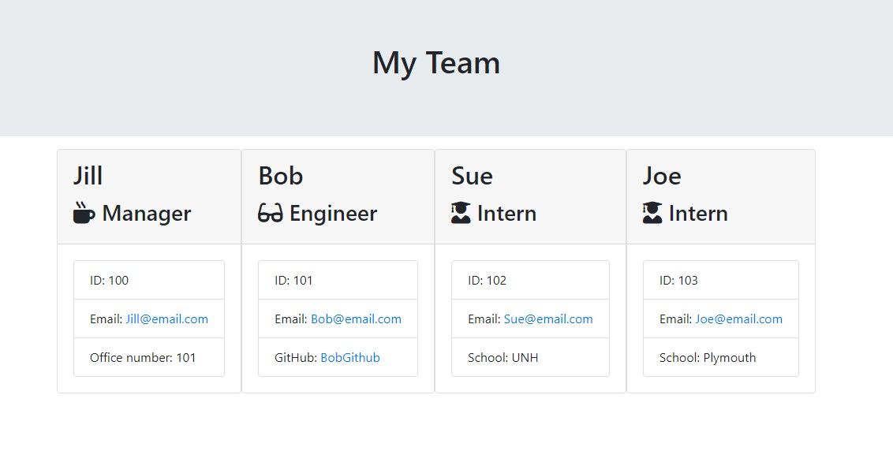

# Project:
<strong>Template Engine - Employee Summary</strong>

Deployable Link - > Not available as this is a Node.js Project. The repo link is https://github.com/ReindeerCode/Template-Engine---Employee-Summary

Video Walk through Link -> https://drive.google.com/file/d/1Hxom3LZQee9O6iVx9q82DaDZ3T_HJF1E/view?usp=sharing

## Table of Contents: 
- [Project:](#project)
  - [Table of Contents:](#table-of-contents)
  - [License:](#license)
  - [Description:](#description)
  - [Images:](#images)
  - [Installation Instructions:](#installation-instructions)
  - [Test Command:](#test-command)
  - [My Github Username:](#my-github-username)
  - [My Email Address:](#my-email-address)
  - [Other Contributors:](#other-contributors)

## License:

## Description:
One of the most important aspects of programming is writing code that is readable, reliable, and maintainable. Oftentimes, *how* we design our code is just as important as the code itself. In this homework assignment, your challenge is to build a Node CLI that takes in information about employees and generates an HTML webpage that displays summaries for each person. Since testing is a key piece in making code maintainable, you will also be ensuring that all unit tests pass.

## Images:

## Installation Instructions: 
1) Install dependencies - The dependencies are, [jest](https://jestjs.io/) for running the provided tests, and [inquirer](https://www.npmjs.com/package/inquirer) for collecting input from the user. 

2) Confirm all tests pass with `npm run test`

3) Run app with `node app.js` 

4) Follow prompts until all team members are added

5) Select to build team

6) Go to HTML file in output folder

## Test Command: 
To test type `npm run test` into the terminal

## My Github Username: 
Check out more projects on my Github at https://github.com/ReindeerCode

## My Email Address:
If you have any question please feel free to email me at ReindeerCode@gmail.com

## Other Contributors:
None at this time
